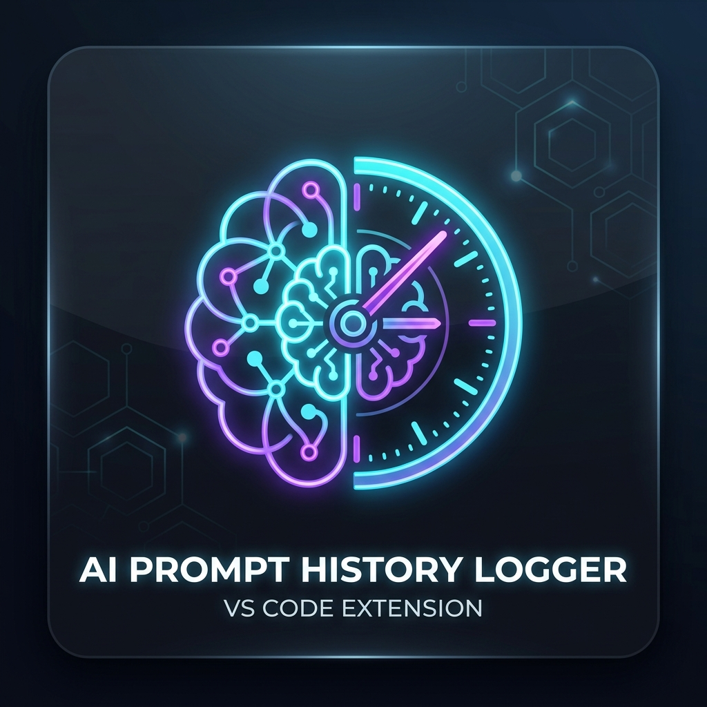

# AI Prompt History Logger 🧠

> A privacy-first, zero-friction VS Code extension in TypeScript that automatically logs every prompt sent to AI assistants/agents directly into your project's workspace with rich context metadata and automatic `.gitignore` protection.



---

## ✨ Features

- 🤖 **Real-Time Antigravity AI Auto-Capture**: Automatically monitors Antigravity conversation transcripts and captures all user prompts and agent instructions with active file path, cursor line, model, and timestamp without needing manual `@history` mentions.
- 🎯 **Automatic Prompt Interception & Storage**: Captures prompts sent in VS Code Chat via `@history`, Antigravity AI sessions, quick command picker, or interactive webview.
- 📁 **Local Project Storage**: Stores records in `.ai/history.json` inside your project's `.ai/` folder (with automatic backward compatibility and migration from legacy `.prompt-history.json`).
- 🛡️ **Automatic `.gitignore` Management**: Guarantees the prompt log file and `.ai/` directory are never accidentally committed or pushed to remote repositories. Creates or appends to `.gitignore` on first write.
- 📊 **Rich Context Metadata**: Captures active file name, relative file path, line counts, selection range, highlighted code snippets, active language, Git branch, and model name.
- ⚡ **Non-Blocking & Concurrent Safe**: Built with `vscode.workspace.fs` async I/O and mutex locking (`AsyncLock`) to prevent file corruption during simultaneous operations.
- 🩹 **Self-Healing Malformed Recovery**: If `.ai/history.json` is modified externally or corrupted, the extension backs up the corrupted version (`.ai/history.json.corrupt.<timestamp>.bak`) and resets cleanly without crashing.
- 🖥️ **Interactive Webview Dashboard**:
  - Full-text instant search across prompts, files, languages, and branches.
  - Source filter (Antigravity AI, Chat Participant, Commands, Webview) and date filters.
  - Aggregate statistics (Total Prompts, Today's Count, Top Active Files, Top Languages).
  - 1-click clipboard copy and individual prompt deletion.
  - Direct file navigation (click a file chip to jump to that line in VS Code).
  - Multi-format export (**Markdown**, **CSV**, **JSON**).
- 🧩 **Sidebar View**: Persistent activity bar tab with search, quick copy, and delete controls.
- 💬 **VS Code Chat Participant (`@history`)**:
  - `@history <prompt>`: Intercepts & logs prompt, then seamlessly streams responses from your configured Language Model (Copilot, GPT-4o, Claude, etc.).
  - `@history /history`: Displays recent 5 logged prompts directly in chat.
  - `@history /stats`: Displays prompt statistics directly in chat.
  - `@history /log <note>`: Explicitly logs a custom note with full editor metadata.

---

## 📋 JSON Log Format (`.ai/history.json`)

Each entry in `.ai/history.json` is formatted as a structured JSON object:

```json
[
  {
    "id": "c7a8684d-e0ec-48ef-be80-5b584988772a",
    "timestamp": "2026-08-31T05:40:00.000Z",
    "prompt": "Refactor this function to use async/await and add JSDoc comments.",
    "metadata": {
      "activeFile": "historyStorage.ts",
      "activeFilePath": "src/services/historyStorage.ts",
      "languageId": "typescript",
      "lineCount": 240,
      "selection": {
        "startLine": 45,
        "startCharacter": 1,
        "endLine": 65,
        "endCharacter": 4,
        "selectedText": "public async logPrompt(promptText: string) { ... }"
      },
      "model": "copilot/gpt-4o",
      "source": "chat-participant",
      "workspaceName": "my-project",
      "gitBranch": "main",
      "tags": []
    }
  }
]
```

---

## ⚙️ Configuration Settings

Configure these settings in your VS Code `settings.json` or through the Settings UI (`Ctrl+,`):

| Setting | Type | Default | Description |
| :--- | :--- | :--- | :--- |
| `aiPromptLogger.enabled` | `boolean` | `true` | Enable or disable automatic prompt logging. |
| `aiPromptLogger.fileName` | `string` | `".ai/history.json"` | File name or relative path for the JSON log file. |
| `aiPromptLogger.autoGitignore` | `boolean` | `true` | Automatically ensure the log file is added to `.gitignore`. |
| `aiPromptLogger.captureMetadata` | `boolean` | `true` | Include active file, selection range, language ID, and Git branch in metadata. |
| `aiPromptLogger.maxEntries` | `number` | `1000` | Maximum number of entries to retain (older entries are trimmed; set to `0` for unlimited). |
| `aiPromptLogger.notifyOnLog` | `boolean` | `false` | Show a notification banner when a prompt is logged. |
| `aiPromptLogger.antigravityAutoCapture` | `boolean` | `true` | Automatically capture and log prompts sent to Antigravity AI in real time. |
| `aiPromptLogger.antigravityBrainPath` | `string` | `""` | Custom path to Antigravity brain directory (empty for auto-detection). |

---

## ⌨️ Commands

| Command | Title | Description |
| :--- | :--- | :--- |
| `aiPromptLogger.openHistoryWebview` | **Open Prompt History Dashboard** | Opens the full interactive Webview dashboard with search, stats, and export tools. |
| `aiPromptLogger.logPrompt` | **Quick Log AI Prompt** | Opens an input box to quickly record an AI prompt with active editor context. |
| `aiPromptLogger.openLogFile` | **Open Log File in Editor** | Directly opens `.ai/history.json` in VS Code text editor. |
| `aiPromptLogger.exportHistory` | **Export Prompt History...** | Exports your workspace prompt history to Markdown (`.md`), CSV (`.csv`), or JSON (`.json`). |
| `aiPromptLogger.clearHistory` | **Clear Prompt History** | Clears all prompt history entries for the active workspace. |
| `aiPromptLogger.refreshHistory` | **Refresh History** | Manually refreshes the dashboard and sidebar views. |

---

## 🚀 Development, Testing & Packaging Guide

### 1. Prerequisites
- Node.js (v18 or newer)
- VS Code (v1.90.0 or newer)

### 2. Install Dependencies
```bash
npm install
```

### 3. Compile the Code
```bash
# Typecheck and bundle with esbuild
npm run compile

# Or start watch mode for live updates
npm run watch
```

### 4. Test in Extension Development Host
1. Open this project directory in VS Code.
2. Press **`F5`** (or go to `Run and Debug` -> `Run Extension`).
3. A new **Extension Development Host** window will open with the extension active.
4. Test functionality:
   - Run the command `AI Prompt Logger: Quick Log AI Prompt` (`Ctrl+Shift+P`).
   - Open Chat (`Ctrl+Alt+I`) and type `@history /stats` or `@history Explain this file`.
   - Check `.prompt-history.json` and `.gitignore` created in your test workspace.
   - Run `AI Prompt Logger: Open Prompt History Dashboard` to interact with the UI.

### 5. Package as `.vsix`
```bash
npm run vsix
```
This generates `ai-prompt-history-logger-1.0.0.vsix` in the workspace root.

### 6. Install `.vsix` into VS Code
```bash
code --install-extension ai-prompt-history-logger-1.0.0.vsix
```
Or open VS Code -> **Extensions View (`Ctrl+Shift+X`)** -> `...` menu (top right) -> **Install from VSIX...** and select the generated file.

---

## 👤 Author & Publisher

- **Publisher / Creator**: Arman Khan
- **Website**: [www.themesbd.shop](https://www.themesbd.shop)

---

## 📄 License
MIT © 2026 [Arman Khan](https://www.themesbd.shop)
